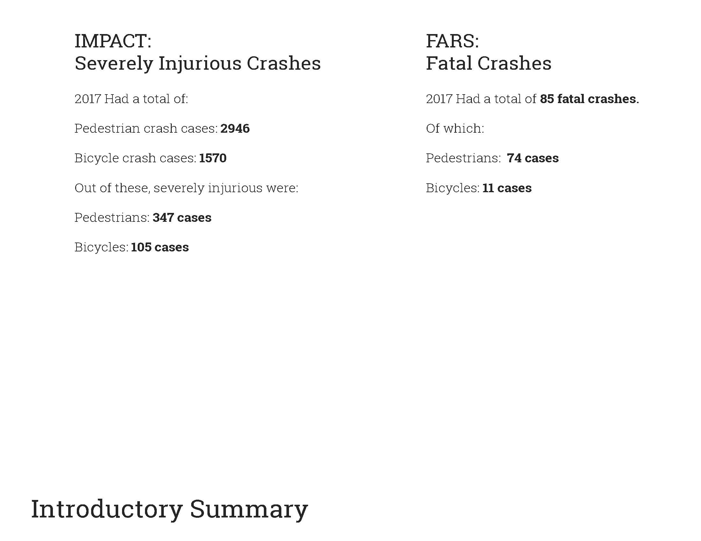
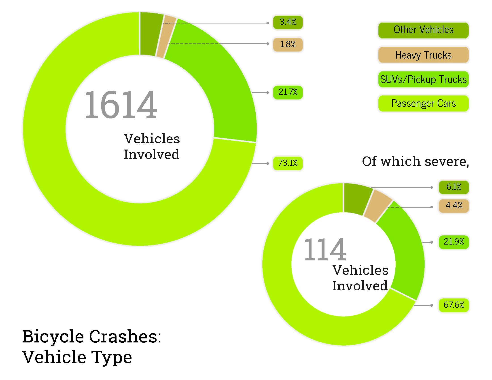
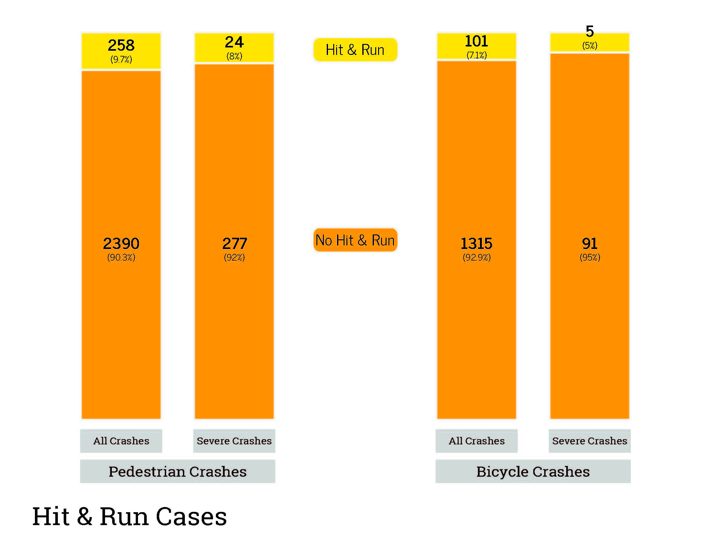
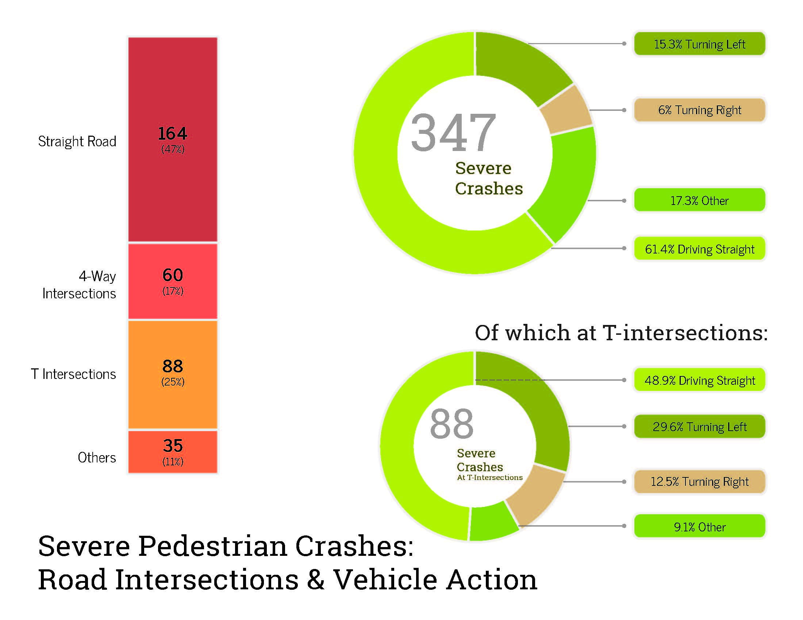
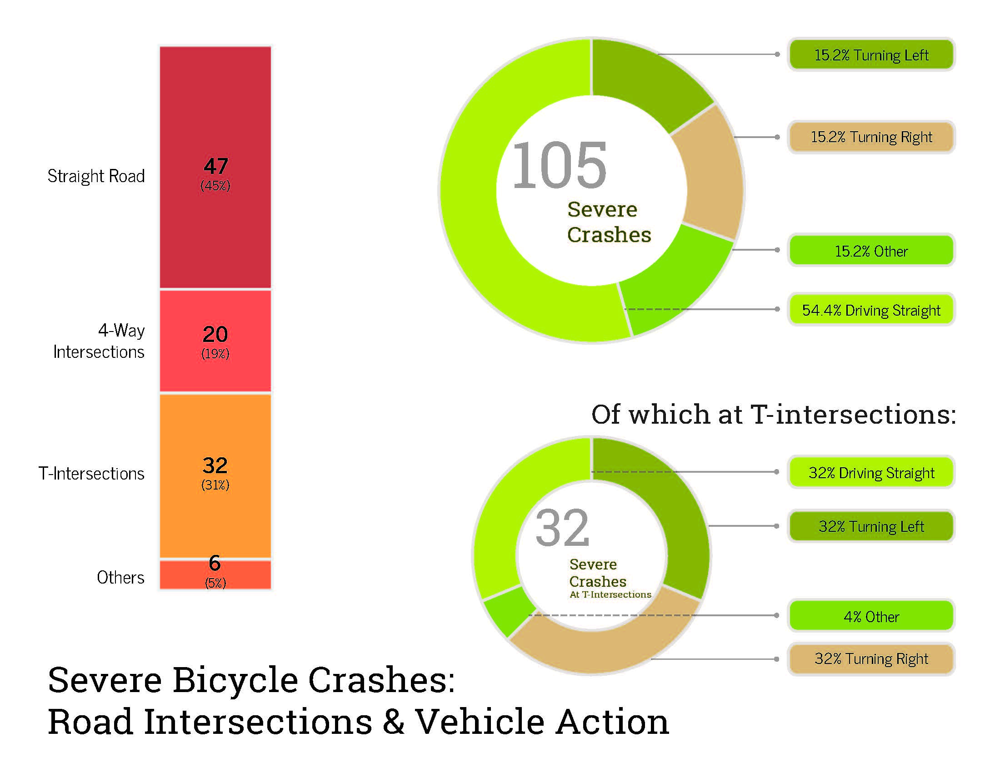
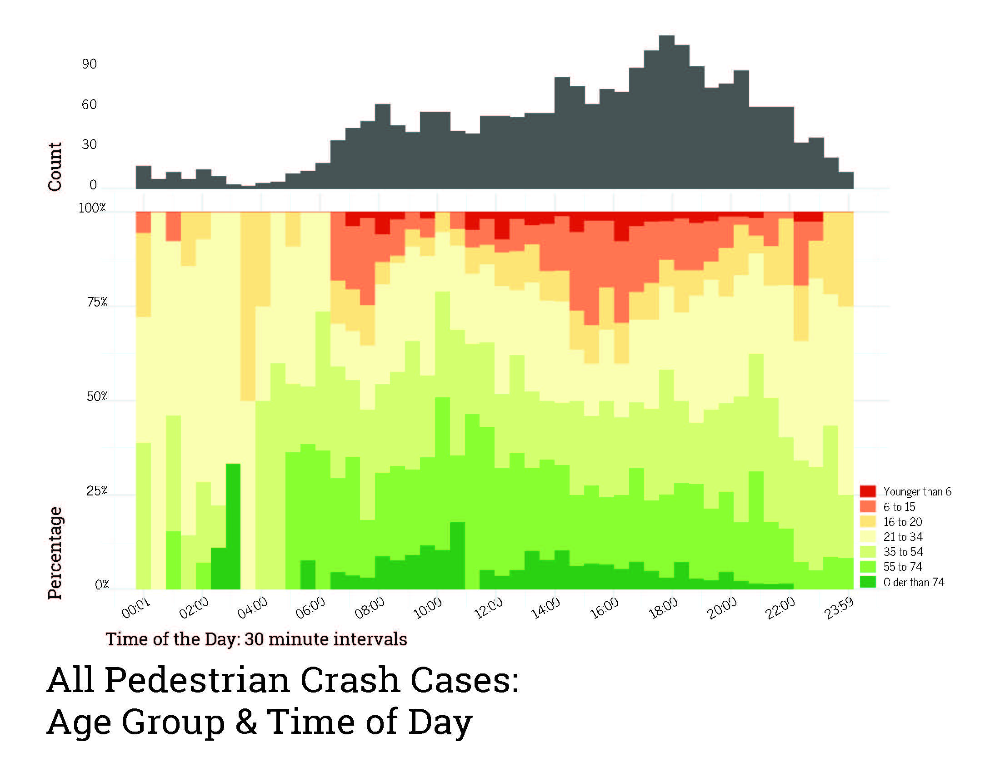
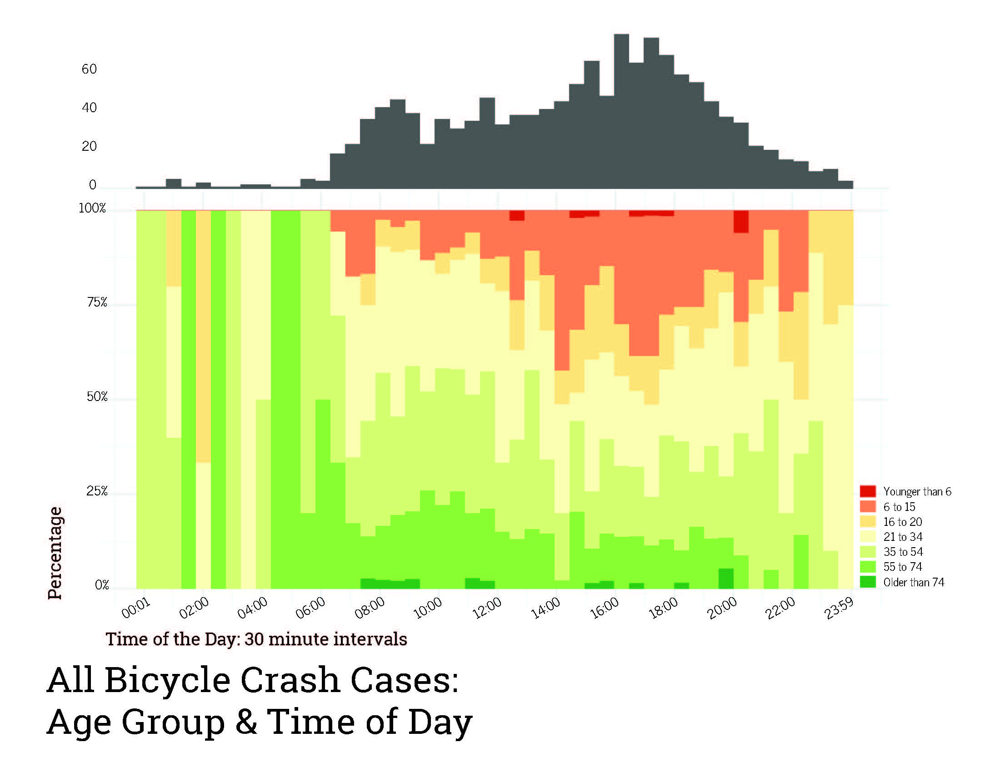
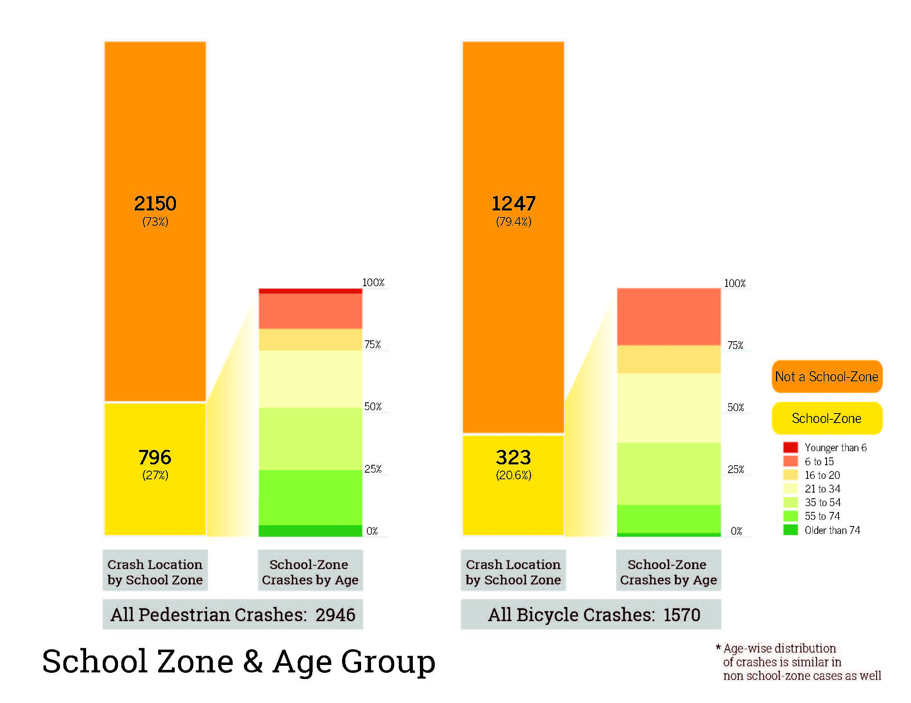
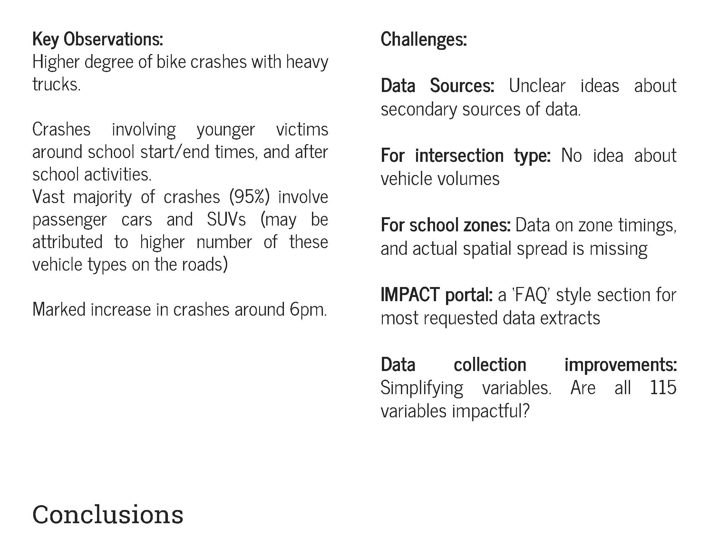

# Insights on Automobile Crashes Involving Bicycles and Pedestrians

By using R and Adobe Illustrator, with data sourced from the MassDOT IMPACT crash portal, I created visualizations of insights on automobile crashes involving pedestrians and bicycles to present to the Massachusetts Bicycle and Pedestrian Advisory Board. By analyzing various variables such as road conditions and kind of road, driver action, vehicle location, time of day I investigated conditions and potential reasons for these crashes

|Slide|Comments|
|:------:|:--------|
||**Introduction:** Summary statistics|
||**Vehicle Type:** Pedestrian crashes: overall, and severe crashes|
||**Vehicle Type:** Bicycle crashes: overall, and severe crashes|
||**Hit & Run Cases:** Pedestrian and bicycle crashes|
||**Road Intersection Type & Vehicle Action:** _Severe_ pedestrian crashes|
||**Road Intersection Type & Vehicle Action:** _Severe_ bicycle crashes|
||**Age group & Time of Day:** _All_ pedestrian crashes|
||**Age group & Time of Day:** _All_ bicycle crashes|
||**School Zone & Age Group:** Pedestrian and bicycle crashes|
||**Conclusions:** Observations & challenges|
